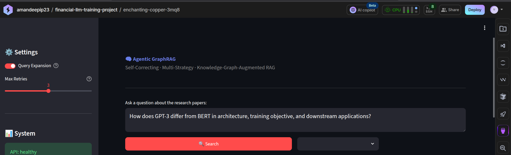
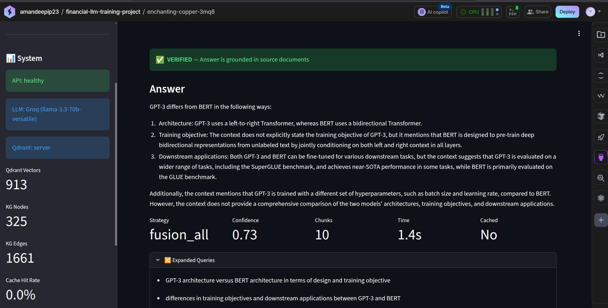
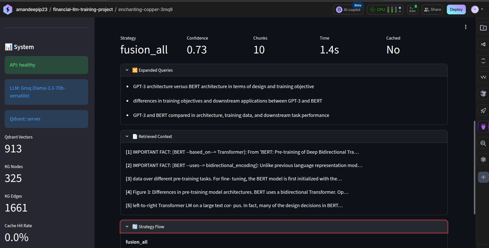
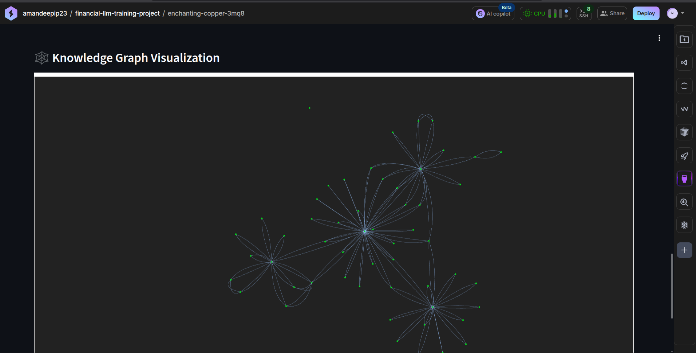
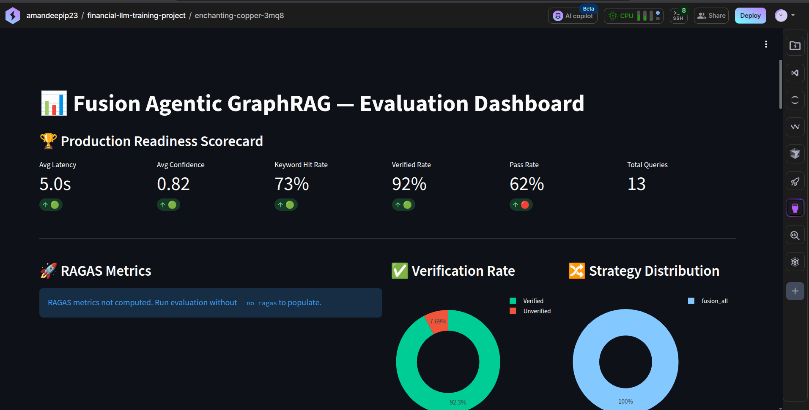
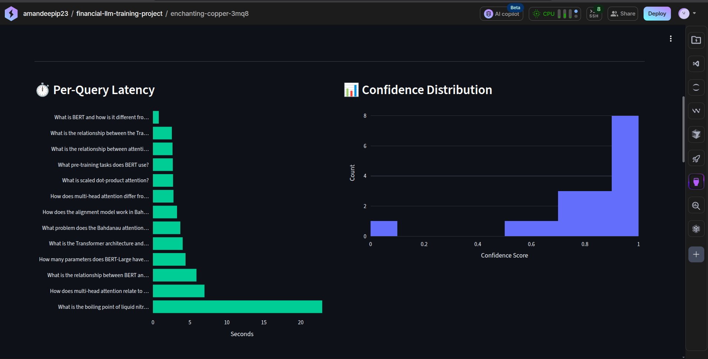
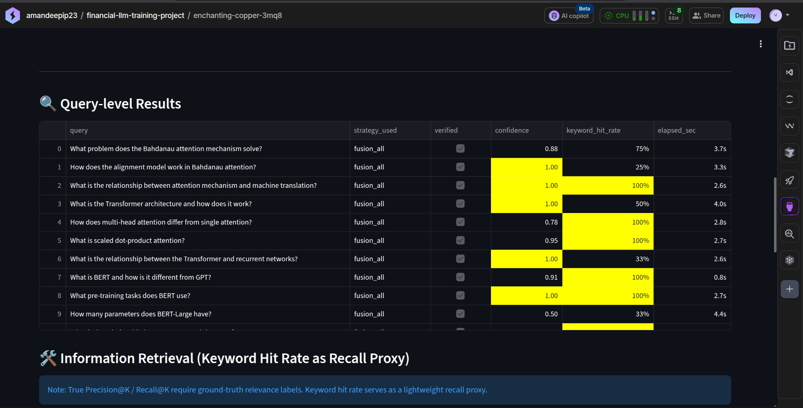
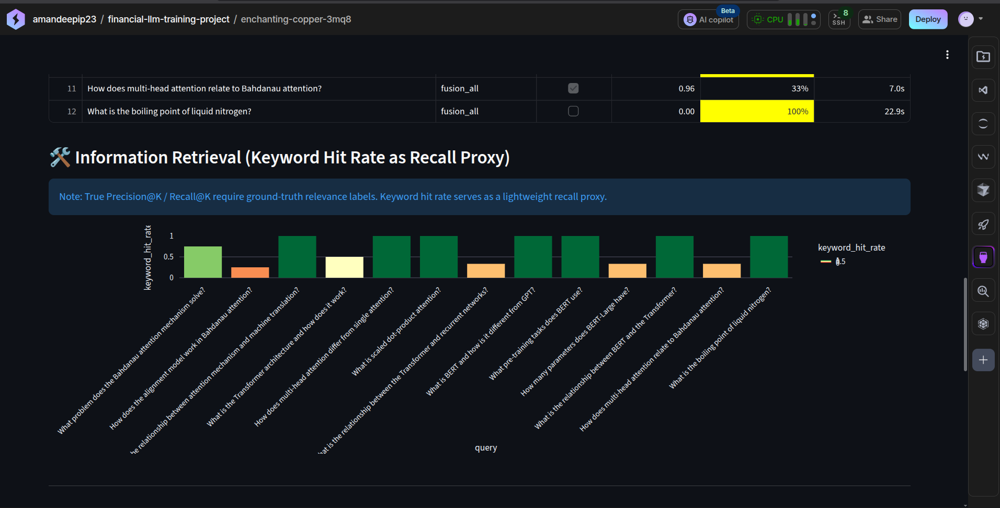

<p align="center">
  <h1 align="center">🧠 Agentic GraphRAG</h1>
  <p align="center">
    <strong>Self-Correcting Multi-Strategy RAG with Knowledge Graph Integration</strong>
  </p>
  <p align="center">
    <a href="#architecture">Architecture</a> •
    <a href="#features">Features</a> •
    <a href="#quick-start">Quick Start</a> •
    <a href="#docker">Docker</a> •
    <a href="#api-reference">API</a> •
    <a href="#evaluation">Evaluation</a>
  </p>
  <p align="center">
    
    
    
    
    
  </p>
</p>

---

An **End-to-End Agentic GraphRAG Platform** that combines **Knowledge Graph traversal**, **vector similarity search**, and **keyword retrieval** into a unified, self-correcting pipeline. Built for research paper Q&A — tested on the foundational NLP papers (*Attention Is All You Need*, *BERT*, *GPT-3*, *Bahdanau Attention*).

## System Capabilities

✅ Knowledge Graph Reasoning
✅ Multi-Strategy Retrieval
✅ Reciprocal Rank Fusion
✅ Cross-Encoder Re-ranking
✅ Entity-Aware Retrieval
✅ Query Expansion
✅ Answer Verification
✅ Confidence Scoring
✅ Docker Deployment
✅ Evaluation Dashboard

## Results

| Metric | Value |
|----------|----------|
| Documents Indexed | 913 chunks |
| Knowledge Graph Nodes | 325 |
| Knowledge Graph Edges | 1661 |
| Retrieval Strategies | Graph + Vector + BM25 |
| Re-ranking Model | ms-marco-MiniLM-L-6-v2 |
| Embedding Model | all-MiniLM-L6-v2 |
| LLM | Groq Llama-3.3-70B |
| Typical Query Latency | 2–5 seconds |
| Deployment | Docker Compose |

## Why GraphRAG?

Traditional RAG systems rely solely on vector similarity retrieval and often struggle with:
- Multi-hop reasoning
- Relationship-based questions
- Entity-centric queries

Agentic GraphRAG combines Knowledge Graph traversal, semantic vector retrieval, and BM25 keyword retrieval to significantly improve retrieval coverage and reasoning quality.

## Architecture

```
                              ┌──────────────┐
                              │   User Query │
                              └──────┬───────┘
                                     │
                              ┌──────▼───────┐
                              │Query Expansion│  (LLM rewrites → 3 variants)
                              └──────┬───────┘
                                     │
                    ┌────────────────┼────────────────┐
                    │                │                │
              ┌─────▼─────┐  ┌──────▼──────┐  ┌─────▼─────┐
              │   Graph    │  │   Vector    │  │   BM25    │
              │ Traversal  │  │   Search    │  │  Keyword  │
              │ (NetworkX) │  │  (Qdrant)   │  │  Search   │
              └─────┬──────┘  └──────┬──────┘  └─────┬─────┘
                    │                │                │
                    └────────────────┼────────────────┘
                                     │
                              ┌──────▼───────┐
                              │  RRF Fusion  │  (Reciprocal Rank Fusion)
                              └──────┬───────┘
                                     │
                              ┌──────▼───────┐
                              │ Cross-Encoder │  (ms-marco-MiniLM-L-6-v2)
                              │  Re-ranking   │
                              └──────┬───────┘
                                     │
                              ┌──────▼───────┐
                              │   LLM Gen    │  (Groq Llama-3.3-70B / GPT-4o / Claude)
                              └──────┬───────┘
                                     │
                              ┌──────▼───────┐
                              │  Verifier    │  (Claim-level grounding check)
                              └──────┬───────┘
                                     │
                          ┌──────────▼──────────┐
                          │  ✅ Verified Answer  │
                          │     + Confidence     │
                          └─────────────────────┘
```

## Features

| Component | Technology | Details |
|-----------|-----------|---------|
| **Retrieval** | Fusion-All | Graph + Vector + BM25 run in parallel → RRF fusion |
| **Knowledge Graph** | NetworkX | 325+ nodes, 1500+ edges, auto-extracted from papers |
| **Vector Store** | Qdrant | all-MiniLM-L6-v2 embeddings (384-dim) |
| **Re-ranking** | Cross-Encoder | ms-marco-MiniLM-L-6-v2 |
| **LLM Support** | Multi-provider | Groq Llama-3.3-70B, OpenAI GPT-4o, Anthropic Claude |
| **Generation** | Token Management | Dynamic token management (prevents truncation), zero prompt leakage |
| **Entity-Aware Retrieval** | Custom Retrieval Logic | Guarantees representation of all major entities in comparison queries |
| **Entity Extraction** | Regex + Domain Vocab | Zero-dependency, canonical normalization |
| **Verification** | Claim-level grounding | Stemming-based keyword matching (handles morphological variations), novel-term penalty |
| **Query Expansion** | Intent Preservation | Optimized multi-query rewriting for search intent preservation |
| **Caching** | In-memory | TTL-based query → answer cache |
| **API** | FastAPI | REST endpoints with Pydantic validation |
| **UI & Dashboard**| Streamlit | Interactive web app + professional evaluation dashboard |

## Engineering Challenges Solved

- Implemented Entity-Aware Chunk Reservation to prevent dominant entities from suppressing minority entities during cross-encoder reranking.
- Hallucination detection via claim-level verification and confidence scoring
- Prompt leakage in local LLMs
- Answer truncation from token limits (solved via dynamic token management)
- Entity normalization and canonicalization (growing KG to 325 nodes without O(n²) explosion)
- Dockerized offline model loading
- Multi-strategy retrieval fusion

## Key Achievements

- Built a hybrid GraphRAG pipeline combining Knowledge Graph traversal, BM25, and vector retrieval.
- Indexed 913 research-document chunks into Qdrant.
- Automatically extracted 325 entities and 1661 relationships.
- Implemented cross-encoder reranking with Reciprocal Rank Fusion.
- Added claim-level answer verification and confidence scoring.
- Dockerized the complete stack (FastAPI + Streamlit + Qdrant).

## 📸 Screenshots

### Evaluation Dashboard Overview



### Main Agentic GraphRAG Interface

- Verified answers
- Confidence scoring
- Retrieved context inspection
- Strategy transparency
- Knowledge graph statistics



### Retrieval Transparency

- Expandable multi-query intent preservation
- Exact source chunk verification
- Strategy-specific tracing



## Demo Queries

### Example 1
**Question:**
How does GPT-3 differ from BERT in architecture, training objective, and downstream applications?

**Answer:**
GPT-3 differs from BERT in the following ways:
1. Architecture: GPT-3 uses a left-to-right Transformer, whereas BERT uses a bidirectional Transformer.
2. Training objective: BERT is designed to pre-train deep bidirectional representations from unlabeled text by jointly conditioning on both left and right context in all layers.
3. Downstream applications: Both GPT-3 and BERT can be fine-tuned for various downstream tasks, but GPT-3 is evaluated on a wider range of tasks, including the SuperGLUE benchmark, and achieves near-SOTA performance in some tasks, while BERT is primarily evaluated on the GLUE benchmark.

**Confidence:**
0.73

**Strategy:**
fusion_all

## 🛠️ Setup Guide

### Prerequisites

- Python 3.10+
- 8GB RAM minimum (16GB recommended for local LLM)

### Local Setup

```bash
# Clone and enter the project
git clone https://github.com/Aman-28-tech/agentic-graphrag.git
cd agentic-graphrag

# Setup environment
chmod +x setup.sh
./setup.sh

# Configure (edit .env with your API keys or use local model)
cp .env.example .env

# Ingest papers (downloads from arXiv + builds index)
source .venv/bin/activate
python ingest.py

# Run the demo
python demo.py
```

### Running Services

You can start the backend, frontend, or CLI using the `main.py` unified entry point, or run them directly:

```bash
# 1. Start FastAPI backend (http://localhost:8000)
python main.py --api
# OR: python api.py

# 2. Start Streamlit UI (http://localhost:8501) — requires API running
python main.py --ui
# OR: streamlit run app.py

# 3. Interactive CLI REPL
python main.py --interactive
# OR: python main.py -i

# 4. Single Query via CLI
python main.py --query "What is the relationship between BERT and the Transformer?"

# 5. Run Demo Queries via CLI
python main.py --demo
```

## Docker

### Prerequisites

- Docker Engine 24+
- Docker Compose v2

### Full Stack (Recommended)

```bash
# 1. Configure environment (Sensitive variables are strictly excluded from the repository)
cp .env.example .env
# Edit .env if using OpenAI/Anthropic API keys

# 2. Build and start all services
docker compose build

# 3. Start Qdrant first
docker compose up -d qdrant

# 4. Run ingestion (one-time — downloads papers, builds index)
docker compose run --rm ingest

# 5. Start API + UI
docker compose up -d api streamlit
```

**Access:**
| Service | URL |
|---------|-----|
| FastAPI (Swagger) | http://localhost:8000/docs |
| Streamlit UI | http://localhost:8501 |
| Evaluation Dashboard | http://localhost:8502 |
| Qdrant Dashboard | http://localhost:6333/dashboard |

> **Note for Cloud Environments (Lightning AI, Codespaces, etc.):**  
> If you are running this in a cloud workspace, `localhost` links will not work directly. Instead, use your editor's **Port Forwarding** tab to open the mapped ports for the API (`8000`), Streamlit Frontend (`8501`), and Evaluation Dashboard (`8502`).

### Docker Commands

```bash
# Run the demo
docker compose run --rm demo

# Run evaluation
docker compose run --rm evaluate

# View logs
docker compose logs -f api

# Stop everything
docker compose down

# Stop and remove volumes (clean reset)
docker compose down -v
```

### Services

| Service | Description | Port |
|---------|-------------|------|
| `qdrant` | Vector database | 6333 |
| `api` | FastAPI backend | 8000 |
| `streamlit` | Main Web UI | 8501 |
| `dashboard` | Evaluation Dashboard UI | 8502 |
| `ingest` | One-shot ingestion pipeline | — |
| `demo` | CLI demo (7 queries) | — |
| `evaluate` | RAGAS evaluation | — |

## API Reference

### `POST /query`

Run a RAG query through the full agentic pipeline.

```bash
curl -X POST http://localhost:8000/query \
  -H "Content-Type: application/json" \
  -d '{"query": "What is the relationship between BERT and the Transformer?"}'
```

**Response:**
```json
{
  "query": "What is the relationship between BERT and the Transformer?",
  "answer": "BERT is based on the Transformer architecture...",
  "strategy_used": "fusion_all",
  "strategies_tried": ["fusion_all"],
  "verified": true,
  "confidence": 0.85,
  "num_chunks": 8,
  "elapsed_sec": 2.341,
  "expanded_queries": ["How does BERT relate to Transformer?", ...],
  "cached": false,
  "context_preview": ["[BERT --based_on--> Transformer]: BERT's model..."]
}
```

### `GET /health`

```bash
curl http://localhost:8000/health
```

### `GET /stats`

```bash
curl http://localhost:8000/stats
```

### `POST /clear-cache`

```bash
curl -X POST http://localhost:8000/clear-cache
```

## Project Structure

```
graphrag_system/
├── config.py              # Central configuration + KG seed data
├── ingest.py              # End-to-end ingestion pipeline
├── graphrag_pipeline.py   # Agentic RAG orchestrator (LangGraph)
├── knowledge_graph.py     # NetworkX knowledge graph
├── entity_extractor.py    # Auto entity/relation extraction (v2)
├── retriever.py           # Multi-strategy retriever + RRF fusion
├── reranker.py            # Cross-encoder re-ranking
├── llm_engine.py          # Multi-provider LLM + verifier
├── vector_store.py        # Qdrant vector operations
├── bm25_retriever.py      # BM25 keyword search
├── cache.py               # TTL-based query cache
├── utils.py               # Shared utilities
├── api.py                 # FastAPI backend
├── app.py                 # Streamlit frontend
├── demo.py                # CLI demo script
├── evaluate.py            # RAGAS evaluation harness
├── main.py                # Interactive REPL
├── Dockerfile             # Multi-stage production build
├── docker-compose.yml     # Full-stack orchestration
├── requirements.txt       # Python dependencies
├── setup.sh               # One-shot local setup
├── .env.example           # Environment template
└── docs/
    └── ai_papers/         # Research PDFs (auto-downloaded)
```

## Configuration

All settings are centralized in `config.py` and can be overridden via environment variables:

| Variable | Default | Description |
|----------|---------|-------------|
| `LLM_PROVIDER` | `local` | `openai`, `anthropic`, or `local` |
| `LOCAL_MODEL_ID` | `Qwen/Qwen2.5-3B-Instruct` | HuggingFace model ID |
| `DEFAULT_STRATEGY` | `fusion_all` | Retrieval strategy |
| `TOP_K_QDRANT` | `15` | Vector search candidates |
| `TOP_K_BM25` | `15` | Keyword search candidates |
| `TOP_K_GRAPH` | `10` | Graph traversal results |
| `TOP_K_RERANK` | `8` | Cross-encoder output size |
| `KG_RESERVED_SLOTS` | `2` | KG facts protected from reranking |
| `CONFIDENCE_THRESHOLD` | `0.35` | Verification confidence threshold |
| `ENABLE_QUERY_EXPANSION` | `true` | Multi-query rewriting |
| `HF_HUB_OFFLINE` | `1` | Skip HuggingFace network calls |

## Knowledge Graph

The KG is built in two stages:

1. **Seed data** (54 nodes, 66 edges) — hand-curated from research papers with 18 rich prose edge contexts
2. **Auto-extraction** (271+ nodes, 1400+ edges) — entities and relations discovered automatically from document chunks


> The dynamically extracted Knowledge Graph showing over 325 nodes and 1600+ edges.

### Entity Types

| Type | Examples | Count |
|------|----------|-------|
| Models | Transformer, BERT, GPT-3 | ~15 |
| Techniques | self_attention, masked_language_modeling | ~35 |
| Benchmarks | SQuAD, GLUE, WMT | ~20 |
| Authors | Vaswani, Devlin, Bahdanau | ~15 |
| Concepts | (auto-extracted) | ~200+ |

### Extraction Features (v2)

- **Canonical normalization**: `transformer` + `Transformer` + `the_transformer` → `Transformer`
- **Garbage filtering**: 80+ academic stop words, OCR artifact detection
- **Co-occurrence capping**: Max 5 entities per chunk (prevents O(n²) edge explosion)
- **Author validation**: Citation context required (year patterns, brackets)

## Evaluation

### Evaluation Summary

The evaluation suite contains intentionally difficult:
- multi-hop reasoning questions
- comparison questions
- out-of-scope refusal tests
- ambiguity handling tests

| Metric | Score |
|----------|----------|
| Verified Rate | 92% |
| Avg Confidence | 0.82 |
| Avg Keyword Hit Rate | 73% |
| Pass Rate | 62% |
| Avg Latency | 5s |

### Evaluation Dashboard

- Pass rate analysis
- Verification metrics
- Latency tracking
- Strategy distribution
- RAGAS integration

#### 1. Production Readiness Scorecard


#### 2. Detailed Evaluation Metrics


#### 3. Per-Query Latency & Confidence Distribution


#### 4. Query-Level Information Retrieval


```bash
# Local
python evaluate.py

# Docker
docker compose run --rm evaluate
```

The evaluation harness tests 13 queries across categories:

| Category | Queries | What It Tests |
|----------|---------|---------------|
| Factual | 5 | Entity attributes, relationships |
| Reasoning | 4 | Multi-hop, comparison, synthesis |
| Refusal | 2 | Out-of-scope rejection |
| Edge Cases | 2 | Ambiguity handling |

## Tech Stack

| Layer | Technology |
|-------|-----------|
| Orchestration | LangChain, LangGraph |
| Vector Database | Qdrant |
| Knowledge Graph | NetworkX |
| Embeddings | all-MiniLM-L6-v2 (SentenceTransformers) |
| Re-ranking | ms-marco-MiniLM-L-6-v2 (CrossEncoder) |
| Keyword Search | BM25 (rank-bm25) |
| LLM | Groq Llama-3.3-70B / GPT-4o / Claude 3.5 |
| Backend | FastAPI + Uvicorn |
| Frontend | Streamlit |
| Evaluation | RAGAS |
| Document Parsing | PyMuPDF + Unstructured |
| Containerization | Docker + Docker Compose |

## License

MIT

---

<p align="center">
  Built by <strong>Amandeep</strong>
</p>
